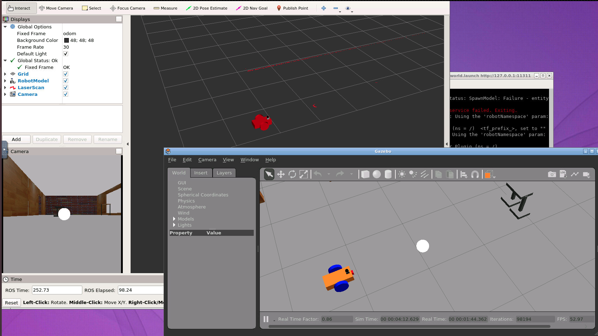
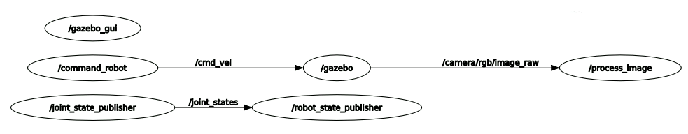

# udacity_robot_ball_chaser
----
 Udacity Robotics Software Engineer Nanodegree Program. The robot chases white colored balls in a Gazebo world environment. The purpose is to Design and build a mobile robot, and house it in a world. Then, program a robot with C++ nodes in ROS to chase white colored ball.




## Structure
```
udacity_robot_ball_chaser            # Project Files
├── my_robot                          # my_robot package
│   ├── launch                        # launch folder for my_robot package
│   │   ├── robot_description.launch
│   │   ├── world.launch
│   ├── meshes                        # meshes folder for hokuyo sensor
│   │   ├── hokuyo.dae
│   ├── model                         # model data for Gazebo
│   │   ├── Building                  # Building data
│   │   │   ├──model.config
│   │   │   ├──model.sdf
│   │   ├── HumanoidRobot             # Humanoid robot data
│   │   │   ├──model
│   │   │   │  ├──model.config
│   │   │   │  ├──model.sdf
│   │   │   ├──model2
│   │   │   │  ├──model.config
│   │   │   │  ├──model.sdf
│   ├── rviz
│   │   ├── udacity.rviz              # Rviz setting file
│   ├── urdf
│   │   ├── myrobot.gazebo            # myrobot data for gazebo
│   │   ├── myrobot.xacro             # xacro data for gazebo
│   ├── worlds
│   │   ├── empty.world
│   │   ├── Udacity_office.world      # world data for Gazebo
│   ├── CMakeLists.txt                # compiler instructions
│   ├── package.xml                   # package infomation
├── ball_chaser                       # ball_chaser package
│   ├── launch
│   │   ├── ball_chaser.launch        # launch folder for launch files
│   ├── msg
│   │   ├── drive.msg
│   ├── src                           # source folder for C++ scripts
│   │   ├── drive_bot.cpp             # sending /cmd message to robot
│   │   ├── process_images.cpp        # process image to move robot
│   ├── srv                           # service folder for ROS services
│   │   ├── DriveToTarget.srv
│   ├── CMakeLists.txt                # compiler instructions
│   ├── package.xml                   # package info
└──
```
**my_robot**: This package spawn the world and the robot to Gazebo simulator.

**ball_chaser**: This package send command message to the robot for chasing the white ball.
## rqt graph (ROS message structure)


## Prerequisites
 
* Install [ROS kinetic (ros-kinetic-desktop-full)](http://wiki.ros.org/kinetic/Installation/Ubuntu) on Linux.
* Build requiremet package
``` 
$ chmod +x build.sh
$ bash build.sh
```
---
## Build and Launch Ball Chaser

1. Clone and initialize project with a workspace.
```console
$ mkdir -p udacity_ws/src
$ cd udacity_ws/src
$ git clone https://github.com/mantues/udacity_robot_ball_chaser_kinetic_package
$ cd ..
$ catkin_make
```

2. Launch the world
```
$ source devel/setup.bash
$ roslaunch my_robot world.launch
```

3. Open another terminal (Ctrl+Shift+T), and launch the `ball_chaser` package
```
$ cd udacity_robot_ball_chaser
$ source devel/setup.bash
$ roslaunch ball_chaser ball_chaser.launch
```

4. Move the white ball and place in front of the mobile robot. The robot will follow the ball.

---
## Build amcl package

```
$ mkdir -p ~/Desktop/udacity_ws/src
$ cd ~/Desktop/udacity_ws/src
$ git clone https://github.com/mantues/udacity_robot_ball_chaser_kinetic_package
$ cd ~/Desktop/udacity_ws
$ wget "https://drive.google.com/uc?export=download&id=19mtEc43J4ap9QeB9LFLjjItggebN4iKZ" -O map.pgm
$ cp map.pgm src/udacity_robot_ball_chaser_kinetic_package/myrobot/maps/map.pgm
$ chmod +x ~/Desktop/udacity_ws/src/udacity_robot_ball_chaser_kinetic_package/teleop_twist_keyboard/teleop_twist_keyboard.py
$ catkin_make
$ source ~/Desktop/udacity_ws/devel/setup.bash
```
