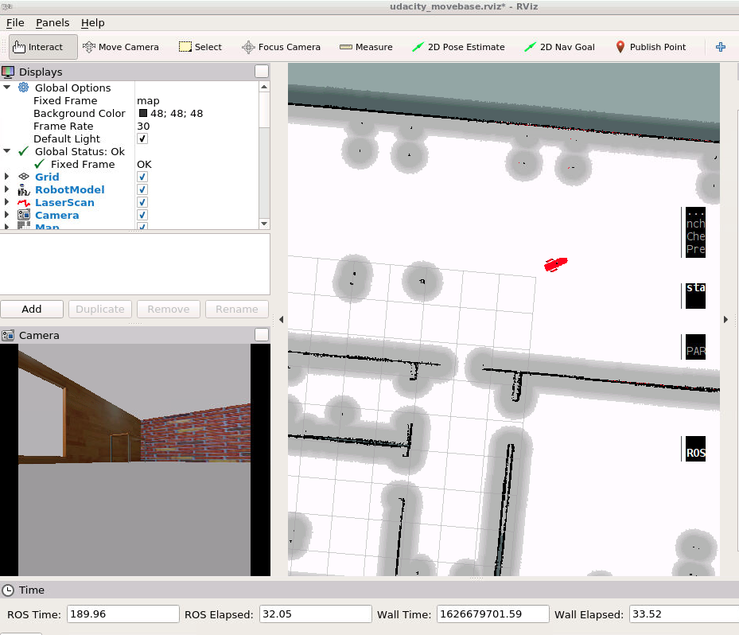
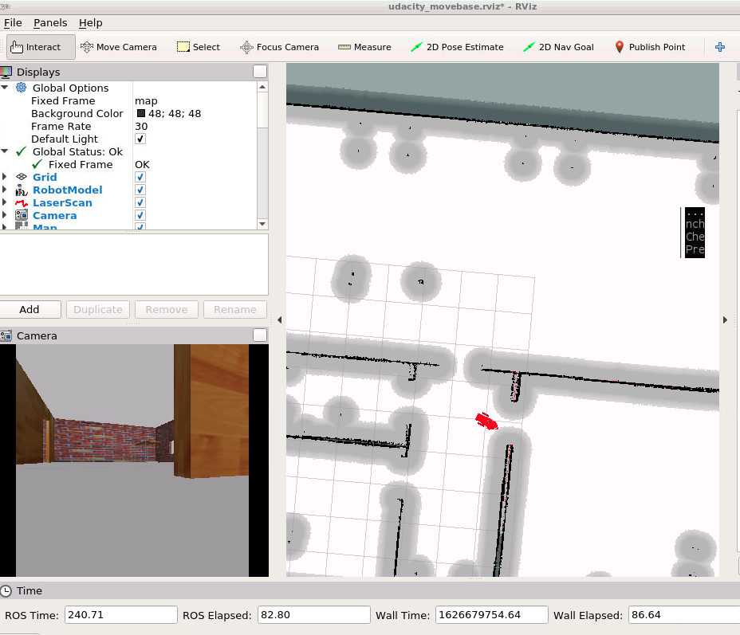

・ To build robot ball chaser, detail is [here.](https://github.com/mantues/udacity_robot_ball_chaser)

---
## AMCL package(ROS-kinetic-package)
Udacity Robotics Software Engineer Nanodegree Program. This robot guesses where you are from the map using AMCL (Adaptive Monte Carlo Localization) package.



---
## Structure
```
udacity_robot_ball_chaser            # Project Files
├──myrobot                           # my_robot package
│   ├──configuration_files           # config file
│   ├──launch                        # launch folder for my_robot package
│   ├──maps                          # mapdata for AMCL package
│   ├──meshes                        # meshes folder for hokuyo sensor
│   ├──rviz                          # Rviz setting file
│   ├──urdf                          # myrobot data for gazebo
│   ├──worlds                        # world data for gazebo
├── teleop_twist_keyboard            # teleop package
├── slam_gmapping                    # gmapping package
├── openslam_gmapping                # gmapping package
└── ball_chaser                      # ball_chaser package

```
## rqt-graph
```

```
---
## Prerequisites
 
* Install [ROS kinetic (ros-kinetic-desktop-full)](http://wiki.ros.org/kinetic/Installation/Ubuntu) on Linux.
* Build requirement package
```
$ bash build.sh
```
## Build package

```
$ mkdir -p ~/Desktop/udacity_ws/src
$ cd ~/Desktop/udacity_ws/src
$ git clone https://github.com/mantues/udacity_robot_ball_chaser_kinetic_package
$ git clone https://github.com/ros-perception/slam_gmapping
$ git clone https://github.com/ros-perception/openslam_gmapping.git
$ cd ~/Desktop/udacity_ws
$ catkin_make
$ source ~/Desktop/udacity_ws/devel/setup.bash
```
## Making a world map using g-mapping package
```
$ roslaunch myrobot nav_world.launch
```
another shell
```
$ roslaunch myrobot gmapping.launch
```
another shell
```
$ roslaunch myrobot teleop.launch
```
Control the robot to complete the map.
another shell
```
$ rosrun map_server map_saver -f <filename>
```
## Launch AMCL package to estimate my position.
```
$ roslaunch myrobot nav_world.launch
```
another shell
```
$ roslaunch myrobot amcl.launch
```
another shell
```
$ roslaunch myrobot teleop.launch
```

another shell (TIPS)
 How to reconfigure AMCL using rqt_reconfigure's graphical user interface.
```
$ rosrun rqt_reconfigure rqt_reconfigure
```

Move the robot to check locatization.




